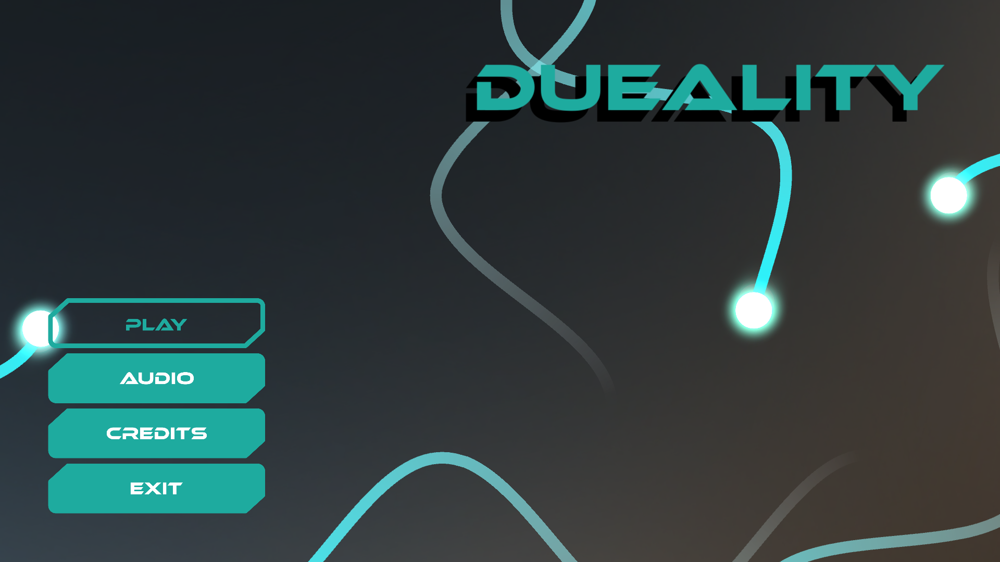
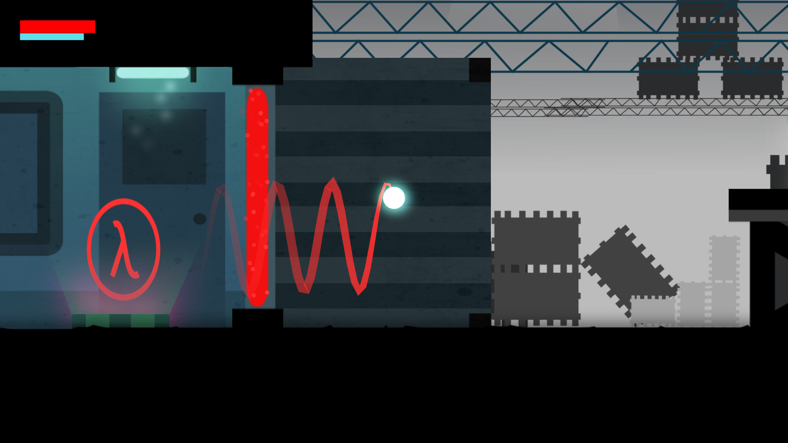
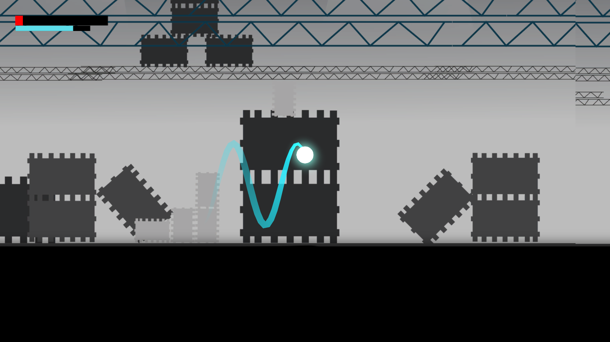

# Deuality
Made in Game Jam Jan/17

The theme for the Global Game Jam was "Wave", so this game is based on the concept of particle-wave duality, where the player can switch to a "wave" state for a few seconds. The player can change their wave frequency by passing over lambdas to match the frequency required to clear certain barriers, which is the basis for the puzzle aspect of this game.

Team members for this jam include:
* Me
* Anirudh Ayer
* Nick Robinson
* Daniel Molka

Here are a few screenshots showing the mechanics:

